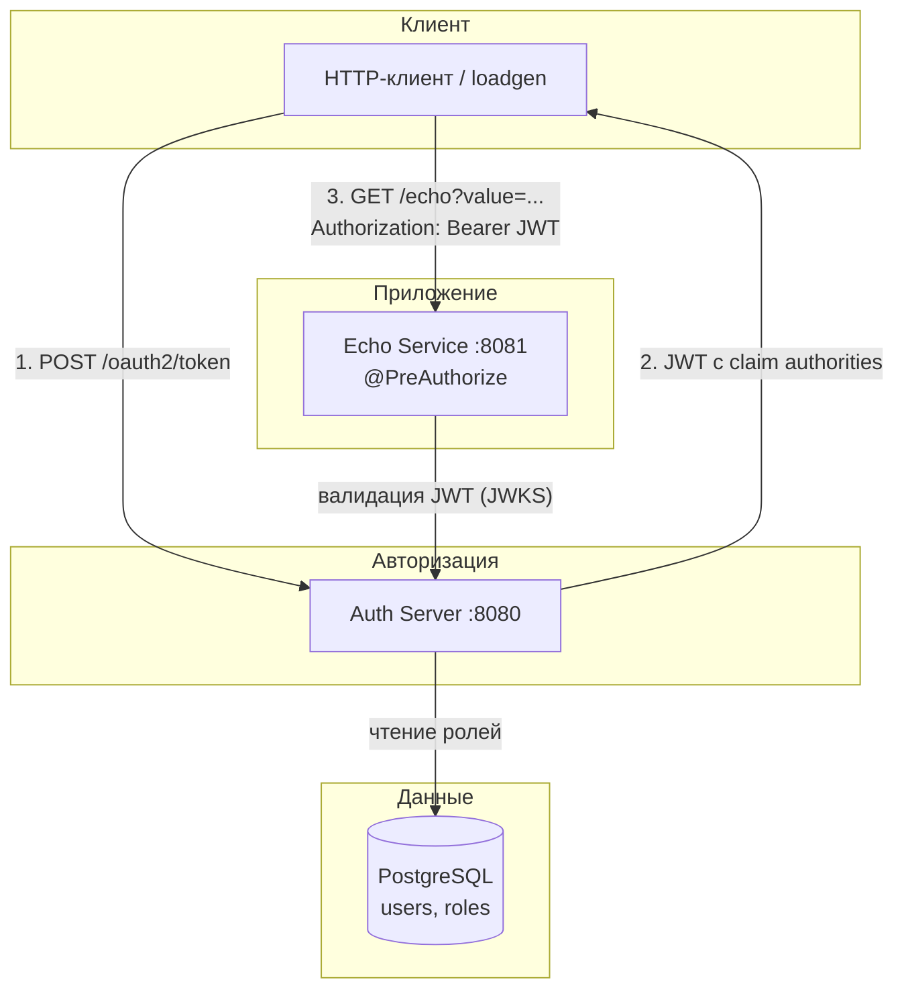
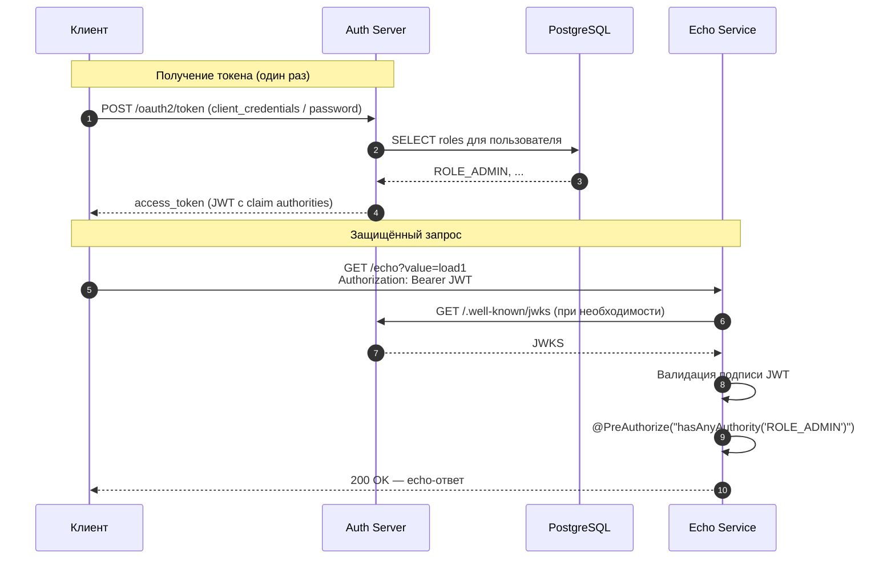
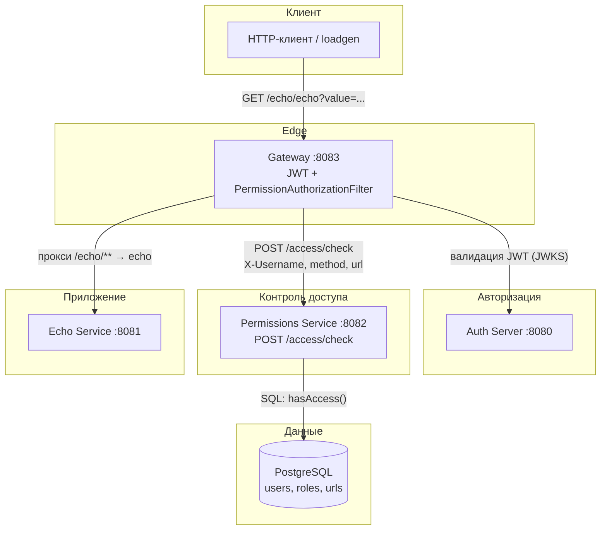
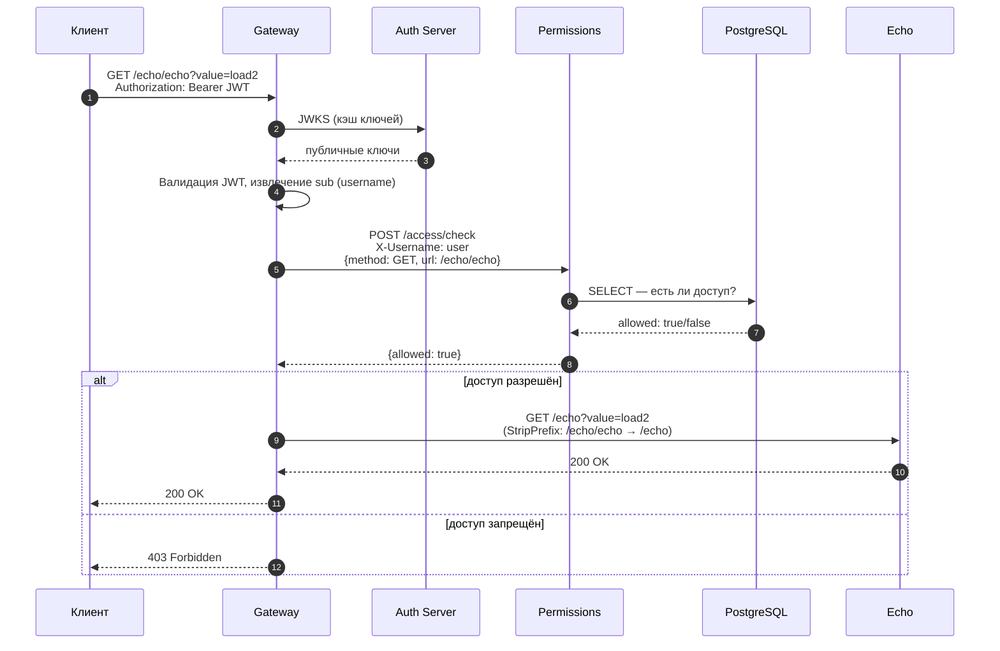
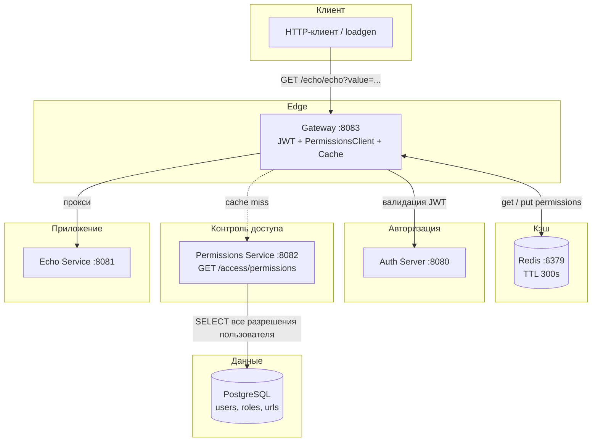
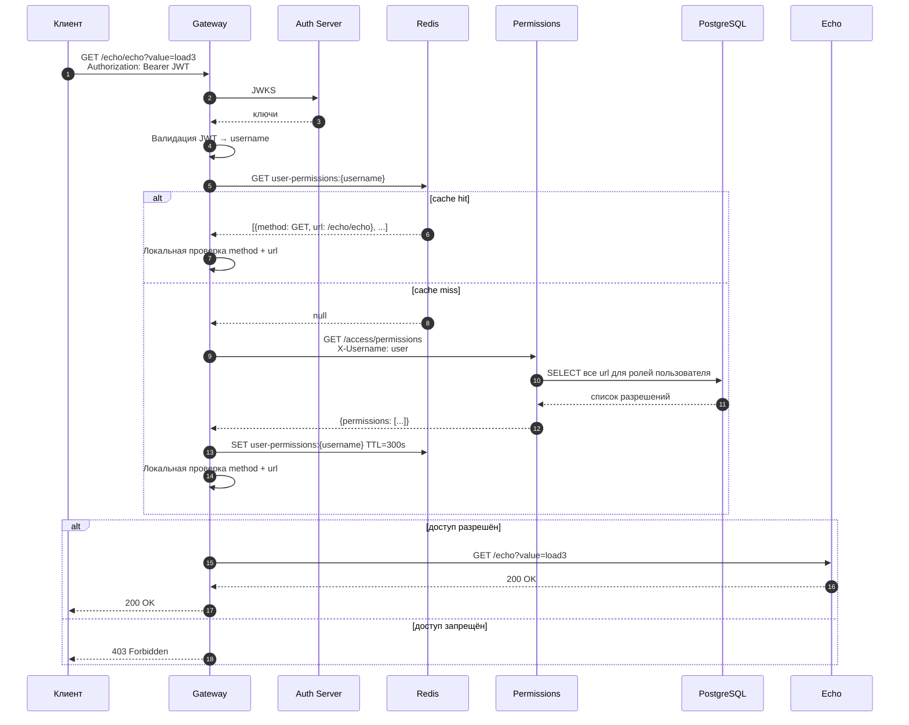

# jwt only

```mermaid
flowchart TB
    subgraph Client["Клиент"]
        C[HTTP-клиент / loadgen]
    end

    subgraph Auth["Авторизация"]
        AS[Auth Server :8080]
    end

    subgraph Data["Данные"]
        PG[(PostgreSQL<br/>users, roles)]
    end

    subgraph App["Приложение"]
        EC[Echo Service :8081<br/>@PreAuthorize]
    end

    C -->|"1. POST /oauth2/token"| AS
    AS -->|"чтение ролей"| PG
    AS -->|"2. JWT с claim authorities"| C

    C -->|"3. GET /echo?value=...<br/>Authorization: Bearer JWT"| EC
    EC -->|"валидация JWT (JWKS)"| AS
```

```mermaid
sequenceDiagram
    autonumber
    participant C as Клиент
    participant AS as Auth Server
    participant PG as PostgreSQL
    participant EC as Echo Service

    Note over C,AS: Получение токена (один раз)
    C->>AS: POST /oauth2/token (client_credentials / password)
    AS->>PG: SELECT roles для пользователя
    PG-->>AS: ROLE_ADMIN, ...
    AS-->>C: access_token (JWT с claim authorities)

    Note over C,EC: Защищённый запрос
    C->>EC: GET /echo?value=load1<br/>Authorization: Bearer JWT
    EC->>AS: GET /.well-known/jwks (при необходимости)
    AS-->>EC: JWKS
    EC->>EC: Валидация подписи JWT
    EC->>EC: @PreAuthorize("hasAnyAuthority('ROLE_ADMIN')")
    EC-->>C: 200 OK — echo-ответ
```

# permissions

```mermaid
flowchart TB
    subgraph Client["Клиент"]
        C[HTTP-клиент / loadgen]
    end

    subgraph Edge["Edge"]
        GW[Gateway :8083<br/>JWT + PermissionAuthorizationFilter]
    end

    subgraph Auth["Авторизация"]
        AS[Auth Server :8080]
    end

    subgraph Permissions["Контроль доступа"]
        PS[Permissions Service :8082<br/>POST /access/check]
    end

    subgraph Data["Данные"]
        PG[(PostgreSQL<br/>users, roles, urls)]
    end

    subgraph App["Приложение"]
        EC[Echo Service :8081]
    end

    C -->|"GET /echo/echo?value=..."| GW
    GW -->|"валидация JWT (JWKS)"| AS
    GW -->|"POST /access/check<br/>X-Username, method, url"| PS
    PS -->|"SQL: hasAccess()"| PG
    GW -->|"прокси /echo/** → echo"| EC
```

```mermaid
sequenceDiagram
    autonumber
    participant C as Клиент
    participant GW as Gateway
    participant AS as Auth Server
    participant PS as Permissions
    participant PG as PostgreSQL
    participant EC as Echo

    C->>GW: GET /echo/echo?value=load2<br/>Authorization: Bearer JWT

    GW->>AS: JWKS (кэш ключей)
    AS-->>GW: публичные ключи
    GW->>GW: Валидация JWT, извлечение sub (username)

    GW->>PS: POST /access/check<br/>X-Username: user<br/>{method: GET, url: /echo/echo}
    PS->>PG: SELECT — есть ли доступ?
    PG-->>PS: allowed: true/false
    PS-->>GW: {allowed: true}

    alt доступ разрешён
        GW->>EC: GET /echo?value=load2<br/>(StripPrefix: /echo/echo → /echo)
        EC-->>GW: 200 OK
        GW-->>C: 200 OK
    else доступ запрещён
        GW-->>C: 403 Forbidden
    end
```
# permissions-cached

```mermaid
flowchart TB
    subgraph Client["Клиент"]
        C[HTTP-клиент / loadgen]
    end

    subgraph Edge["Edge"]
        GW[Gateway :8083<br/>JWT + PermissionsClient + Cache]
    end

    subgraph Cache["Кэш"]
        RD[(Redis :6379<br/>TTL 300s)]
    end

    subgraph Auth["Авторизация"]
        AS[Auth Server :8080]
    end

    subgraph Permissions["Контроль доступа"]
        PS[Permissions Service :8082<br/>GET /access/permissions]
    end

    subgraph Data["Данные"]
        PG[(PostgreSQL<br/>users, roles, urls)]
    end

    subgraph App["Приложение"]
        EC[Echo Service :8081]
    end

    C -->|"GET /echo/echo?value=..."| GW
    GW -->|"валидация JWT"| AS
    GW <-->|"get / put permissions"| RD
    GW -.->|"cache miss"| PS
    PS -->|"SELECT все разрешения пользователя"| PG
    GW -->|"прокси"| EC
```

```mermaid
sequenceDiagram
    autonumber
    participant C as Клиент
    participant GW as Gateway
    participant AS as Auth Server
    participant RD as Redis
    participant PS as Permissions
    participant PG as PostgreSQL
    participant EC as Echo

    C->>GW: GET /echo/echo?value=load3<br/>Authorization: Bearer JWT

    GW->>AS: JWKS
    AS-->>GW: ключи
    GW->>GW: Валидация JWT → username

    GW->>RD: GET user-permissions:{username}

    alt cache hit
        RD-->>GW: [{method: GET, url: /echo/echo}, ...]
        GW->>GW: Локальная проверка method + url
    else cache miss
        RD-->>GW: null
        GW->>PS: GET /access/permissions<br/>X-Username: user
        PS->>PG: SELECT все url для ролей пользователя
        PG-->>PS: список разрешений
        PS-->>GW: {permissions: [...]}
        GW->>RD: SET user-permissions:{username} TTL=300s
        GW->>GW: Локальная проверка method + url
    end

    alt доступ разрешён
        GW->>EC: GET /echo?value=load3
        EC-->>GW: 200 OK
        GW-->>C: 200 OK
    else доступ запрещён
        GW-->>C: 403 Forbidden
    end
```
